<div align="center">
  
</div>

## ▷ abstract

> First-author research, production GPU inference, and Kaggle weekends — **reproducible or it didn't happen.**

- 🔬 **research** — dense RGB-D SLAM with 3D Gaussian Splatting, **SOTA rendering** on TUM-RGBD / Replica / ScanNet
- ⚙️ **inference** — digital-human serving on trpc + Triton; streaming ad-budget forecast serving **500k+ advertisers**
- 🏁 **competitive ML** — Kaggle **silver & bronze**, all solo runs on a single GPU
- 🎓 **now** — M.Sc. INFOTECH @ University of Stuttgart

## ▷ experience

**Tencent · Search Ads (AMS)** — algorithm intern · `2026.01 →`
- real-time ad-budget depletion forecast: streaming features + two-stage boosting, serving **500k+ advertisers**
- collaborative multi-agent workflow superseding monolithic agent logic
- digital-human inference service: unit tests, diagnosis tooling, onboarding architecture guide

**Huawei · Cloud Network** — SWE intern · `2025.07 → 2025.10`
- active-probing scheduler: **−20% task churn** at >95% coverage
- parallel-sharded query engine over **>100M daily records**

**3D Vision Lab · BJTU** — research assistant
- 📄 first author — *Unleashing the Power of RGB-Opacity of Gaussians for Dense RGB-D SLAM* (under review)

## ▷ track record

> full table with highlights in [Awards.md](Awards.md) — every rank verifiable at the leaderboard

- 🥈 **Kaggle Silver** · [Stanford RNA 3D Folding](https://www.kaggle.com/competitions/stanford-rna-3d-folding) · `49/1516`
- 🥉 **Kaggle Bronze** · [UM Game-Playing Strength of MCTS variants](https://www.kaggle.com/competitions/um-game-playing-strength-of-mcts-variants) · `101/1680`
- 🏅 **Top 1.6%** · [DRW Crypto Market Prediction](https://www.kaggle.com/competitions/drw-crypto-market-prediction) · `18/1091`
- 🏅 **Top 2%** · [Tencent Advertising Algorithm Contest](https://algo.qq.com/2025) · `29/1334`

## ▷ open source

- 🎥 [**bili-fact-checker**](https://github.com/T-64/bili-fact-checker) — videos → auditable, evidence-backed reports
- 🧠 [**LatentSelf**](https://github.com/T-64/LatentSelf) — your AI chat history as a 3D cognitive map
- 🇩🇪 [**deutsch-daily**](https://github.com/T-64/deutsch-daily) — Tagesschau, auto-turned into daily DE–CN lessons
- 🗣 **gaussian talking-head** — 65 fps 3DGS avatar · RTF 0.3 *(public soon 👀)*

## ▷ stack

```text
$ cat ~/stack.txt
langs      python · c++ · java · typescript
ml / 3d    pytorch · cuda · 3d gaussian splatting · tensorrt · triton
data       sql · flink · kafka · xgboost
infra      docker · linux · github-actions
loading    german (A2 → …) · triton kernels
```

## ▷ contributions

<div align="center">
  <picture>
    <source media="(prefers-color-scheme: dark)" srcset="https://raw.githubusercontent.com/T-64/T-64/output/github-contribution-grid-snake-dark.svg" />
    
  </picture>
</div>

<div align="center">
  <em>“把每一件小事做到可复现。” — make every small thing reproducible.</em>
</div>
